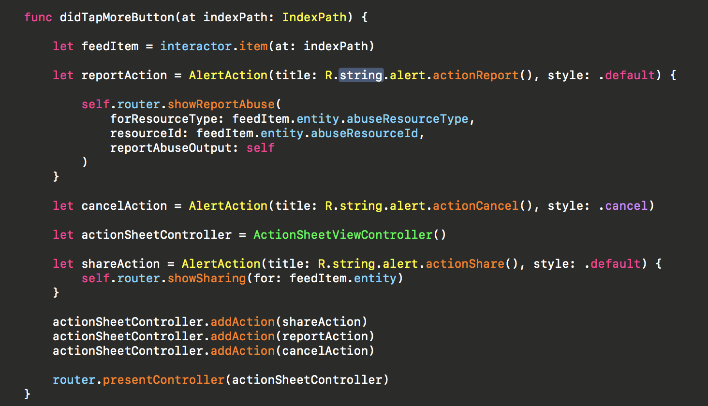

# My Xcode theme

This repository contains the Xcode theme that I use every day. The repository was created looking at John Sundell's [XcodeTheme repository](https://github.com/JohnSundell/XcodeTheme)



## Installing using Marathon

The easiest way to install this Xcode theme is using **[Marathon](https://github.com/johnsundell/marathon)** by John Sundell:

1. Install the latest version of [Marathon](https://github.com/JohnSundell/Marathon) if you haven't already:
```
$ git clone https://github.com/johnsundell/marathon.git
$ cd Marathon && make
```

2. Run the install script which will install this Xcode theme for you:
```
marathon run mashkovmax/xcodetheme
```

## Installing manually

1. Clone this repo:
```
$ git clone https://github.com/johnsundell/xcodetheme.git
```

2. Create a folder at this path if it doesn't exist already:
```
~/Library/Developer/Xcode/UserData/FontAndColorThemes
```

3. Copy the file `Max.xccolortheme` into the above folder.
